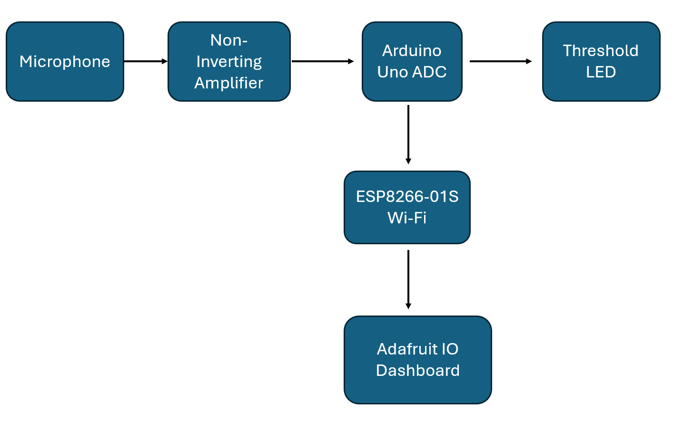
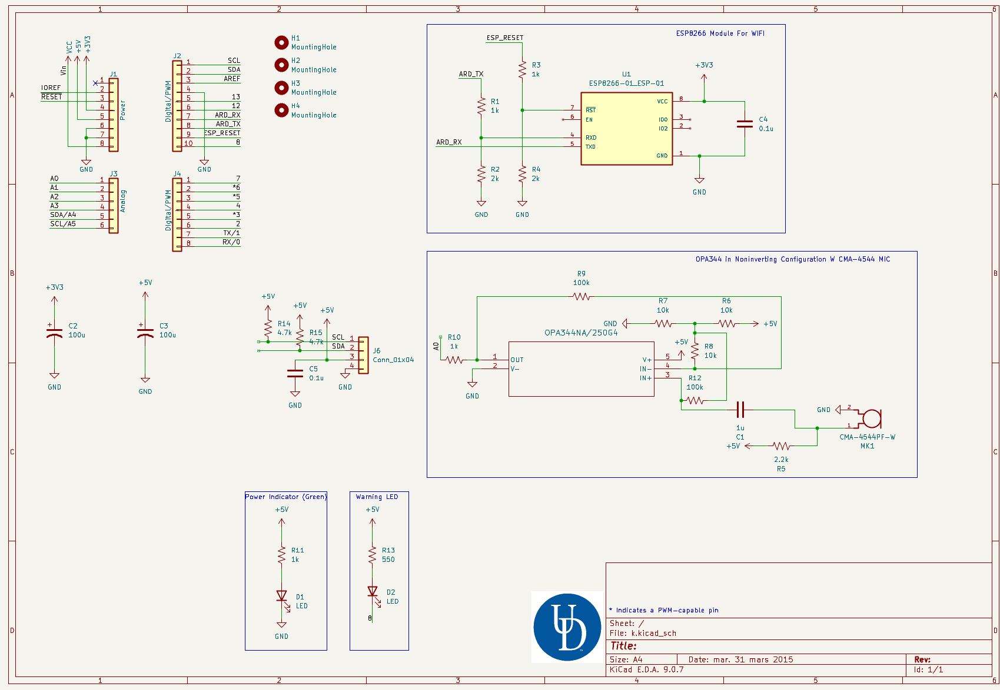
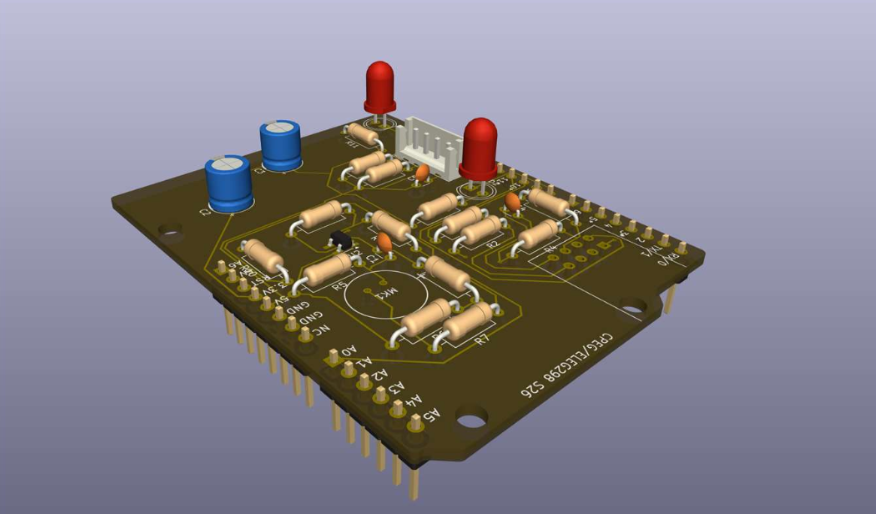
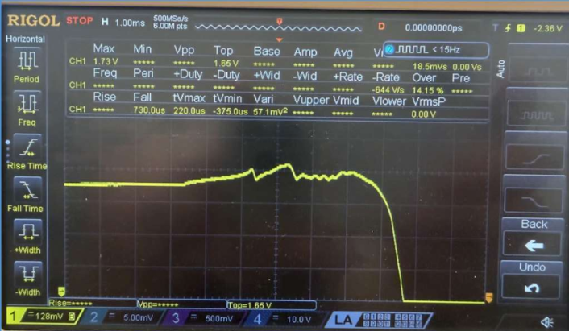
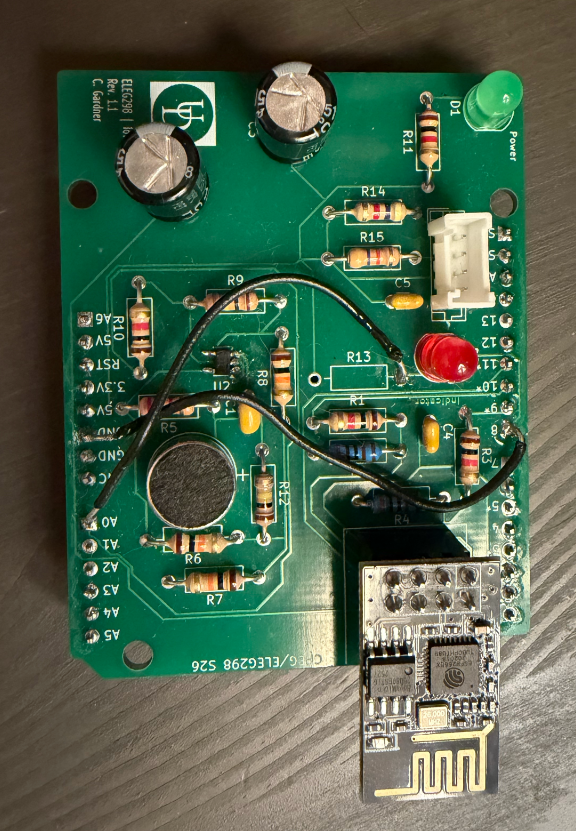

# Venue_Decibel_Meter

## Overview
Designed and fabricated an Arduino Uno IoT shield featuring an analog microphone front end, OPA344 signal conditioning, and ESP8266 wireless connectivity. Developed embedded firmware to acquire ADC data, estimate sound pressure levels, and stream real-time measurements to the Adafruit IO dashboard.

## Specifications
**Microcontroller:** Arduino Uno

**Wireless Module:** ESP8266-01S Wi-Fi

**Analog Front End:** OPA344 rail-to-rail operational amplifier

**Sensor:** CMA-4544PF-W electret condenser microphone

**PCB:** Custom two-layer KiCad Arduino Uno shield with ground plane

**Signal Processing:** 10-bit ADC sampling, peak-to-peak voltage calculation, RMS conversion, and dB estimation

**Cloud Platform:** Adafruit IO for real-time data visualization

**Indicator:** On-board LED for programmable sound threshold warning

## Block Diagram

## Control Strategy
The microphone captures ambient audio and the OPA344 amplifies the AC signal. The Arduino continuously samples the amplified waveform through its ADC over a fixed time window. Peak-to-peak voltage is converted to RMS voltage and then estimated in decibels using firmware. The calculated dB value is transmitted via the ESP8266 to Adafruit IO for real-time visualization, while a warning LED indicates when the sound level exceeds a preset threshold.

## PCB Design
Integrated the microphone, OPA344 analog front end, ESP8266-01S, status LEDs, and supporting passive components into a compact 2-layer shield form factor.

## Measured Results
- Successfully acquired microphone signals and converted them to digital data using the Arduino ADC.
- Estimated sound levels of approximately 45–49 dB during testing.
- Demonstrated reliable wireless transmission of real-time measurements to the Adafruit IO dashboard.
- Verified continuous cloud monitoring with live graphing and remote reset functionality via the ESP8266 Wi-Fi interface.

Capture of sound pulse into microphone

## Version History

### Version 1.0
- Identified an ADC routing error during hardware bring-up and implemented a jumper-wire rework to restore analog signal acquisition.
- Successfully validated full system functionality following hardware modification, including sensor acquisition and IoT communication.

